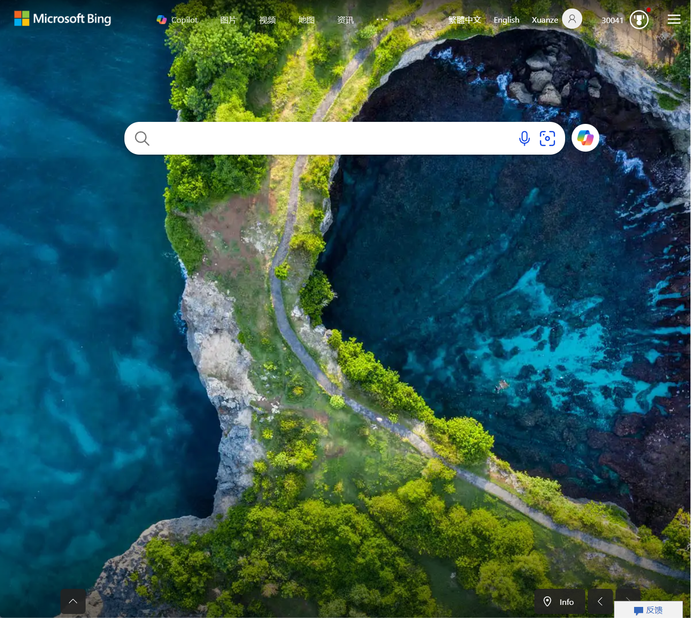
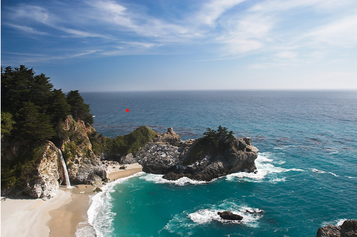
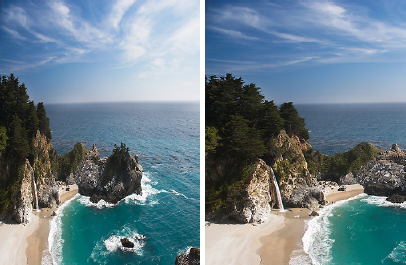
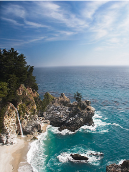

# 作业1：接缝裁剪

> 作业 ddl：2025年3月16日（周日）23:59
> 提交内容：源代码 + 实验报告（pdf文件） + 其他补充说明文件（可选）

## 引言

打开 bing 浏览器首页并全屏，你会看到类似于下图的首页背景图片

    

这时候如果你改变浏览器窗口的大小（比如缩小窗口的长度），你会看到首页背景图片变成下下面这样

    

如你所料，背景图片的尺寸随着窗口大小发生变化。但仔细观察，不难发现**这两张图片并不是简单的裁剪（chopping）或者缩放（rescaling）的关系**。

事实上，在图像处理领域，常常会遇到需要改变给定图像的长宽比例，同时保留原始图片信息的情形（如在网页中插入的图片，需要灵活地根据用户当前浏览页面的长宽比来调整插入图片的长宽比）。

例如，对于下面的图片，如何将其长度缩小为原来的一半同时保留其主要信息呢？

    

最 naive 的想法是截取图像的半边，或者对图像做线性伸缩。其结果如下图所示。

    

左图：将原始图像的长度线性伸缩为原来的一半的结果；右图：对原始图像截取左半侧的结果

可以看到，我们确实达到了改变图像长宽比例的要求。但是原始图像的主要信息并没有得到充分保留：
- 对于左图，由于图像整体的长度被压缩，可以明显看到山丘和树木存在畸变；
- 对于右图，由于只截取了左半边，右半边的海角和礁石的信息没有得到保留

那么我们如何才能实现如下图所示的**既能改变长宽比例，又能尽可能多地保留图像信息**呢？

    

Seam Carving的结果：图像的主要信息得到了保留。

## 实验要求

实现 2007 年 ToG 论文 [Seam Carving for Content-Aware Image Resizing](https://dl.acm.org/doi/10.1145/1276377.1276390) 中的接缝裁剪算法，用以改变图像的长宽比例。

实验报告中请展示如下内容：
- 简述算法的基本原理
- 展示图片裁剪的结果（缩小图片的长度、宽度）
- 对比实验：文中的方法与其他方法的对比（如截断、伸缩等）
- 对实验结果的必要说明

实现说明：
- 本次作业提供了 `MATLAB` 的程序框架 [same_carving.m](./seam_carving.m)，只需要实现其中的 `seam_carve_image` 函数
- 本次实验不限制编程语言，但如果你不打算使用提供的 `MATLAB` 框架，请自行搭建类似的图形界面
- 如果你有新解法或其他方面的创新，欢迎在报告中呈现

> 作为练习，我们鼓励大家完成论文中除接缝裁剪外的其他应用（如 Image Enlarging, Content Amplification, etc）

