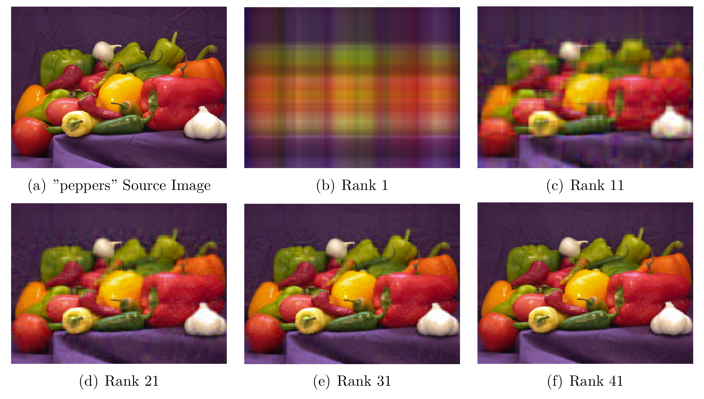
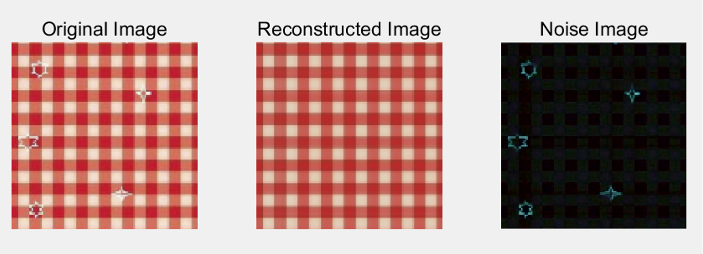

# 作业2：基于矩阵分解的图像处理

> 作业 ddl：2025年3月29日（周六）23:59
> 提交内容：源代码 + 实验报告（pdf文件） + 其他补充说明文件（可选）

## 引言

近几年，二维生成模型（2D generative models） 在图像合成、风格转换和超分辨率等任务上取得了显著进展，表现出极高的生成质量和多样性。这一进步在很大程度上得益于生成对抗网络（GANs）、变分自编码器（VAEs）、扩散模型（Diffusion Models）以及流匹配（Flow Matching）等方法的快速发展。

其中，图像的数学表达形式对这些模型的成功起到了重要作用。在计算机视觉和图像处理领域，图像通常被表示为标准的矩阵（即像素的数值排列），每个通道可以看作一个矩阵，或多个通道组合成一个三维张量。这种结构天然适用于线性代数工具，如奇异值分解（SVD）、主成分分析（PCA）和傅立叶变换（FFT），并且在深度学习框架下，卷积神经网络（CNNs）、自注意力（Self-Attention）和其他神经算子能够高效地在这些矩阵结构上进行计算和特征提取。

此外，矩阵的代数性质（如秩、奇异值分布和谱特性）使得低维表示学习（Latent Representation Learning）成为可能，从而促进了现代生成模型的高效训练和优化。例如，扩散模型通过在高维图像空间中逐步去噪，利用矩阵结构的平滑特性来重建高质量的图像。这些数学特性进一步解释了为什么基于矩阵表示的二维生成模型在近几年能够持续提升生成效果，并在艺术创作、医学影像和内容生成等领域取得成功。

### SVD 在图像和数据压缩中的应用  

**奇异值分解（SVD）** 是一种强大的矩阵分解工具，广泛应用于**图像压缩**和**数据降维**等任务，具有高效、可解释性强的特点。  

#### **1. 图像压缩**  
在图像处理中，SVD 可用于**高效存储、去噪和特征提取**。  
- **存储优化**：对一张灰度图像（表示为矩阵 \( A \)）进行 SVD 分解 \( A = U \Sigma V^T \)，只保留最大的前 \( k \) 个奇异值，即可近似原始图像，同时减少存储空间。  
- **图像传输**：适用于**低带宽环境**，如远程监控、卫星图像压缩和医学影像存储。  
- **去噪**：去除较小奇异值对应的信息，有效减少图像噪声，提高视觉质量。  
- **特征提取**：在计算机视觉任务（如 OCR、模式识别）中，SVD 可用于提取主要特征，提高分类和识别的准确性。  

#### **2. 数据压缩与降维**  
SVD 还广泛用于各种数据处理任务，特别是在**高维数据降维和特征提取**方面：
- **文本分析（LSA, Latent Semantic Analysis）**：用于文档分类、信息检索和搜索引擎优化。  
- **推荐系统（矩阵分解）**：Netflix、Spotify 等个性化推荐中使用 SVD 分解用户评分矩阵，以预测用户喜好。  
- **生物信息学**：基因表达数据通常具有高维特征，SVD 可用于降维，提高聚类分析和模式识别的效率。  
- **金融数据分析**：在股票市场数据降维、风险建模和因子分析中，SVD 被用于提取关键影响因素。  
- **传感器数据压缩**：在 IoT（物联网）和环境监测中，SVD 可用于减少数据存储需求，提高传感器数据的分析效率。  

在第一个任务中，我们希望实现如下的效果：

    

基于矩阵SVD分解的图像压缩的结果

我们会发现，随着保留的奇异值分解保留的rank增长到一定程度，得到的图片与原图片几乎无差异，但是存储量会显著变小。

我们参考如下的阅读材料即可：[奇异值的物理意义是什么？](https://www.zhihu.com/question/22237507)

### 低秩分解在图像和数据修复中的应用

**低秩分解（Low-Rank Decomposition）**  是一种重要的矩阵分解方法，在图像修复和数据填补等任务中表现出色。它利用矩阵的低秩结构来提取主要信息，忽略冗余或噪声数据，从而实现高效的去噪和修复。

在第二个任务中，我们希望实现如下的效果：

    

基于矩阵低秩分解的图像修复的结果

乍眼一看是不是觉得非常神奇？这里的想法来源于，噪声部分是稀疏的，但是为矩阵带来了很高的秩。Robust PCA 假设一个观测矩阵 \( A \) 由两部分组成：

- **低秩矩阵 $$ L $$**：表示主要的结构信息（如图像的主体部分）；  
- **稀疏矩阵 $$ S $$**：表示异常值或噪声（如图像中的损坏区域或遮挡物）。  

即：
$$
A = L + S
$$
其中：
- \( L \) 是低秩的（主成分）；  
- \( S \) 是稀疏的（损坏或噪声部分）。  

为了从 \( A \) 中分解出 \( L \) 和 \( S \)，RPCA 采用如下优化问题：

$$
\min_{L, S} \| L \|_* + \lambda \| S \|_1, \quad \text{s.t.} \quad A = L + S
$$

其中：
- **$ \| L \|_* $（核范数，Nuclear Norm）**：即 $$ L $$ 的奇异值之和，用于鼓励 $$ L $$ 具有低秩结构。
- **$$ \| S \|_1 $$（L1 范数，Sparse Norm）**：即矩阵元素的绝对值之和，用于鼓励 $$ S $$ 具有稀疏性（仅少量非零元素）。
- **$$ \lambda $$**：权衡低秩部分和稀疏部分的重要性，一般可取 $$ \lambda = \frac{1}{\max(m, n)} $$。

该优化问题可通过 **增强拉格朗日乘子法（ALM）、交替方向乘子法（ADMM）** 等数值优化方法进行求解。

我们给出如下的文献进行参考：

(1)[Robust PCA](https://arxiv.org/pdf/0912.3599)：开山工作？
(2)[Repairing Sparse Low-rank Texture](https://people.csail.mit.edu/zhangzd/papers/recover_low-rank_texture_final.pdf)
(3)[TILT: Transform Invariant Low-rank Textures](https://arxiv.org/pdf/1012.3216)

(2)(3)对于优化问题做了改进，对于完成该任务的同学，我们只要求尽可能完整地实现上面提到的简化版算法。

## 实验要求

**本门课程的核心目标之一是，希望大家学会，在写论文时，如何展示自己的结果，想一想什么是必要的？同时也完全没有必要写一堆没有价值的“八股文”**

实验报告中请展示如下内容：
- 简述算法的基本原理
- 展示图片压缩/低秩修复的结果（至少需要展示随着保留的奇异值分解rank增多，得到图像的变化，也鼓励使用基本的度量，如与原图片对应矩阵的差异（使用矩阵差的二范数等）/修复的原图和修复的结果）
- 对实验结果的必要说明

实现说明：
- 本次实验不限制编程语言，请自行搭建类似的图形界面
- 我们鼓励大家测试多种多样的案例，也可以发现算法的局限性
- 如果你有新解法或其他方面的创新，欢迎在报告中呈现，例如现在图像修复的重要手段之一是利用二维扩散模型

